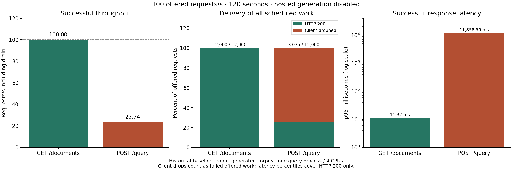

# HTTP load-test report — 2026-09-10

The private server sustains **100 document-list requests/second** and **25 complete
extractive queries/second** on the generated fixture corpus. At 100 offered query
RPS, the four-core query allocation saturates: only 25.62% of offered work completes,
and successful p95 latency rises to 11.86 seconds. This is a measured capacity limit,
not a claim of 100 successful LLM answers/second.

## Environment and method

- Linux host: 16 logical CPUs, 30.99 GiB RAM, encrypted local SSD; shared with other
  applications. Docker 29.6.1 / Compose 5.3.0. Query is capped at 4 CPUs / 2 GiB;
  worker at 4 CPUs / 3 GiB. One query process, two native embedding threads.
- Real Caddy → JWT/quota gateway → ingest/query → PostgreSQL/pgvector and Redis.
  Query uses pinned CPU MiniLM embeddings, hybrid retrieval and extractive generation.
  All services and model caches were warm. Telemetry remained enabled.
- Six generated documents, 29 chunks and 60 entities across two tenants; the query
  tenant owns five documents. This small corpus cannot establish large-corpus scaling.
- An isolated Linux container on the same server generated open-loop traffic through
  Caddy's internal HTTP endpoint. Forty identities distribute requests below the
  gateway's normal per-user 5-RPS quota. This measures server capacity, excluding
  WAN/Tailscale/TLS overhead. Interactive HTTPS acceptance ran separately from the PC.
- Ramps: 10/25/50/100 RPS for 30 seconds each, separately for metadata and query.
  Confirmation: 25/100 RPS for 120 seconds each. Soak: 20 query RPS for 600 seconds.
- Driver ceiling: 256 concurrent requests; excess scheduled work is counted as
  `client_dropped`, never silently removed. HTTP timeout: 30 seconds. No retries.
  Latency starts at the scheduled dispatch time; percentiles cover successful HTTP
  responses. Throughput includes drain time. Failures and dropped work are reported
  separately, preventing the latency distribution from hiding missed offered work.
- Hosted generation was explicitly disabled. Preflight requires extractive output.
  No 100-RPS workload was sent to OpenAI. The API key is restored for normal use.

## Two-minute confirmation

| Endpoint | Offered RPS | HTTP 200 / offered | Client drops | Completed RPS | p50 / p95 / p99 ms |
| --- | ---: | ---: | ---: | ---: | --- |
| GET /documents | 25 | 3,000 / 3,000 | 0 | 25.01 | 7.08 / 11.20 / 22.26 |
| GET /documents | 100 | 12,000 / 12,000 | 0 | 100.00 | 6.51 / 11.32 / 20.18 |
| POST /query | 25 | 3,000 / 3,000 | 0 | 25.00 | 63.13 / 103.58 / 113.72 |
| POST /query | 100 | 3,075 / 12,000 | 8,925 | 23.74 | 10,539.11 / 11,858.59 / 12,211.62 |

No HTTP 429/5xx occurred in these four stages. The overloaded query stage required
129.54 seconds including drain. Dispatch p99 stayed between 1.26 and 2.92 ms,
so the valid Linux driver kept the offered schedule even during saturation.



The short ramp independently found the same query boundary: 25 RPS passed; 50 and
100 offered RPS produced approximately 23 completed RPS with many client drops.
Query CPU reached approximately 423% (four cores) and memory stayed around 1.05 GiB
of its 2-GiB cap. CPU inference is the first observed constraint. Increasing replicas
or CPU, batching embeddings and testing a realistic corpus are future experiments;
none of those gains is claimed by this report.

## Soak and corrective work

The first ten-minute 20-RPS query soak returned 11,999 HTTP 200 and one HTTP 502:
99.99% success, p50 60.36 ms, p95 95.71 ms, p99 106.38 ms. No requests were dropped.
Caddy logged `EOF` for the failed request, about 77 seconds into the run. The proxy
default kept idle upstream sockets for two minutes while Uvicorn closed them after
five seconds. The release now retires those sockets after four seconds. This matches
the failure mode described in [Caddy's transport documentation](https://caddyserver.com/docs/caddyfile/directives/reverse_proxy#the-http-transport).
The initial result remains committed; final-image confirmation is recorded in
the release verification notes rather than replacing an inconvenient measurement.

An earlier Windows load generator became starved at 50 RPS (dispatch p99 exceeded
50 seconds). Those results are excluded from server-capacity claims. The replacement
Linux driver held dispatch p99 below 4 ms. Warm PC-to-server HTTPS health checks
were approximately 4 ms, which does not establish application latency under load.

## Real-provider and ingestion acceptance

Three bounded server OpenAI checks used `gpt-4.1-mini-2025-04-14`: a supported English
answer, a supported Croatian answer and an unsupported-question abstention. Observed
end-to-end times were 2.802 / 1.276 / 2.369 seconds. Usage was 623 input and 62 output
tokens in total, approximately **$0.0003484** at $0.40/M input and $1.60/M output.
This is an estimate for these three requests, not the entire session or an invoice.
Pricing reference: [model documentation](https://developers.openai.com/api/docs/models/gpt-4.1-mini).

First-time server PDF/HR-PDF/scanned-image processing completed within the polling
observations of 4.05 / 2.05 / 2.03 seconds (two-second polling resolution). These are
small-fixture observations, not worker throughput measurements. A valid padded PDF
of at least 10 MiB processed successfully. Repeated acceptance uploads return the
same IDs; their near-zero processing waits demonstrate idempotence, not OCR speed.
The browser separately processed a six-page generated PDF and displayed a cited
OpenAI answer. The legacy evidence score is heuristic and can reject useful answers
near its threshold; it is not a calibrated probability of correctness.

## Reproduce and inspect

See [private deployment](../docs/private-deployment.md) for credentials, images and
isolated ports. Use generated fixtures only. Mint at least 40 unique user tokens
for one provisioned tenant into an ignored JSON array; do not publish tokens.
Use the same Compose project and a Linux load generator with the locked Python
environment. Recreate query with the load overlay last:

```sh
docker compose -f docker-compose.yml -f deploy/compose.private.yml \
  -f deploy/compose.load.yml --profile '*' up -d --no-deps --wait query
uv run --locked python scripts/load_test.py --base http://127.0.0.1:9080 \
  --tokens .cache/load-tokens.json --seconds 120 --rates 25,100 \
  --modes documents,query --output .cache/confirmation.json
uv run --locked python scripts/load_test.py --base http://127.0.0.1:9080 \
  --tokens .cache/load-tokens.json --seconds 600 --rates 20 \
  --modes query --output .cache/soak.json
docker compose -f docker-compose.yml -f deploy/compose.secret.yml \
  -f deploy/compose.private.yml --profile '*' up -d --no-deps --wait query
uv run --locked --with matplotlib==3.10.7 python benchmark/plot_results.py
```

[Summaries](results.json), [ramp samples](raw/ramp.json.gz),
[confirmation samples](raw/confirmation.json.gz), [initial soak samples](raw/soak.json.gz)
and the [plotting source](plot_results.py) are committed. Raw samples contain status,
scheduled latency and dispatch lag only; they contain no tokens or document text.
[Resource samples](resources.json) record CPU/memory observations.
Screenshots and release validation are in [the evidence index](../docs/evidence/README.md).

## Transferred-image confirmation

The exported release images were run again for 60 seconds per stage. Metadata
25/100 RPS returned 1,500/6,000 successful responses (p95 24.13/21.41 ms). Query
25 RPS returned all 1,500 responses (p95 109.16 ms). At 100 offered query RPS,
1,605 succeeded, 4,394 were client-dropped, and one received HTTP 401 after 5.017 s.
This final overloaded stage is retained in [raw samples](raw/release-confirmation.json.gz).

The gateway shared one HTTP connection pool between query traffic and signing-key
refresh. At saturation, pending query exchanges can starve the five-second JWKS
fetch, which fails authentication closed. The observed timeout matches that path;
this is a diagnosis from timing and connection ownership, not a captured exception
trace. The gateway now gives identity refresh its own reusable HTTP client and closes
both clients at shutdown. Regression verification records their separate ownership.
The subsequent overload/soak results are recorded below after completion.
