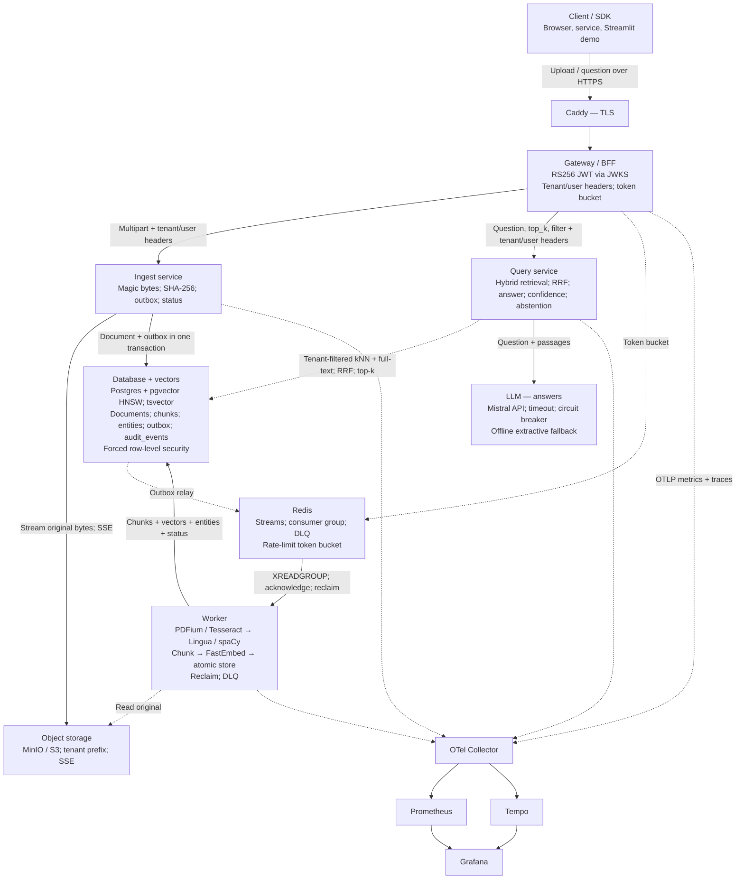
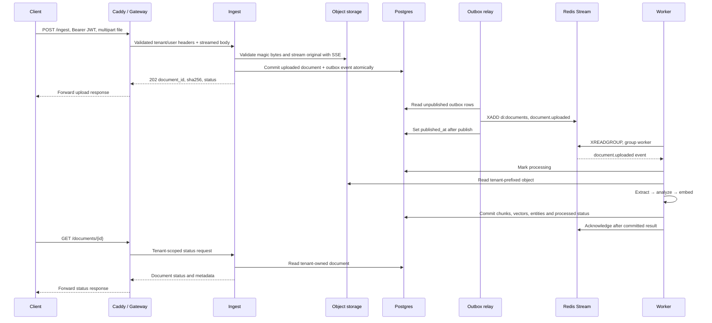
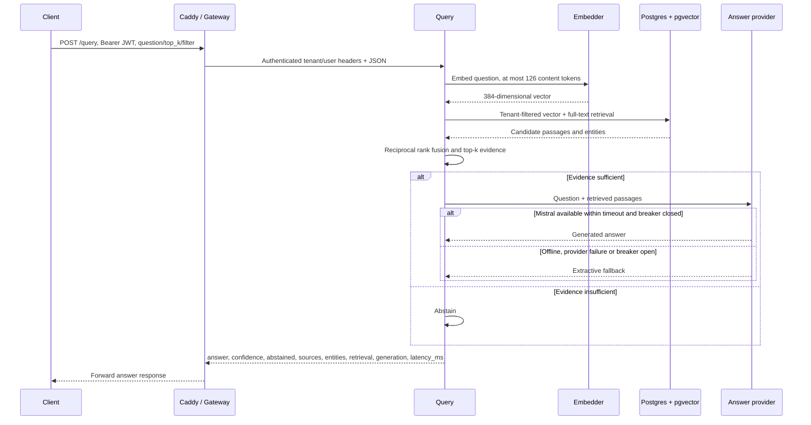

# Architecture

doc-insight turns PDF and image bytes into tenant-scoped, searchable passages with page
citations and extracted entities. The implemented slice is the worker CLI and transactional
Postgres/pgvector storage, pipeline version 6. The target service layer accepts authenticated
uploads, processes them asynchronously, and answers questions using retrieved passages.
This document records both the current boundaries and the contracts that remain to land.

## System diagram

This Mermaid transcription preserves the supplied architecture diagram's component boxes
and data paths. It is a **target architecture**, not a deployment inventory. Solid arrows
denote requests/writes; dashed arrows denote reads, asynchronous delivery or telemetry.
The component table below identifies what is implemented. The reference PNG is not committed.

## Component responsibilities and delivery status

| Component | Responsibility | Status on main |
| --- | --- | --- |
| Client / SDK | Upload files and ask questions | CLI exists; browser/SDK/Streamlit box is a target interface, no shipped client |
| Caddy | Public TLS termination | Lands with lane 5 |
| Gateway, port 8000 | Validate RS256 JWT against JWKS; derive tenant/user; rate-limit and proxy | Lands with lane 4 |
| Ingest, port 8001 | Stream validated uploads to objects; create document/outbox transaction; status reads and relay | Lands with lane 1 |
| Query, port 8002 | Retrieve tenant-owned evidence; generate cited answer or abstain | Implemented; [operation and confidence](query.md) |
| Worker, no HTTP port | Extract → analyze → embed → store | CLI pipeline exists; stream consumer, status transitions and DLQ land with lane 2 |
| Object storage, ports 9000/9001 | Original bytes in `documents`, at `{tenant_id}/{sha256}` | MinIO with mandatory SSE-S3 runs in the Compose `infra` profile; the adapter lands with lane 1 |
| Redis, port 6379 | Event stream, worker group, DLQ and rate-limit buckets | Redis runs in the Compose `infra` profile; consumers/producers land with lanes 1, 2 and 4 |
| Postgres, port 5432 | Relational metadata and 384-dimensional pgvector HNSW index | Implemented, including forced row-level security ([ADR-0005](adr/0005-tenant-row-level-security.md)); outbox lands with lane 1; full-text expression retrieval implemented; `audit_events` delivery unassigned |
| LLM | Mistral answer generation behind a provider boundary; extractive fallback | Implemented; hosted calls are opt-in, offline fallback validated |
| Collector, port 4318; Prometheus; Tempo; Grafana | OTLP/HTTP ingestion, metrics, traces and dashboards | Runs in the Compose `telemetry` profile with a provisioned dashboard; the `doc_insight.observability` helper is implemented ([ADR-0004](adr/0004-opentelemetry.md)) and the CLI emits stage spans; services adopt it as they land |

Ports above are internal contracts. The Compose `infra` and `telemetry` profiles publish every
service on loopback with configurable host ports (see [local stack](local-stack.md)); no
application image is built yet. A target diagram does not imply public access to its internal
services or automatic deployment of every component.
`audit_events` is retained from the reference diagram, but no implementation or migration
is assigned yet. Full-text retrieval uses a `tsvector` expression; a persisted
search column or GIN index is not part of the initial query-service contract.

## Upload and processing path — lands with lanes 1, 2, 4 and 5

Duplicate `(tenant_id, sha256)` uploads return the existing ID with response status
`duplicate`, without reprocessing. `duplicate` is not a database lifecycle state.
The lifecycle is `uploaded → processing → processed | failed`; failures record a sanitized
error class and short message. The object write is outside the SQL transaction: the outbox
does not make object storage and Postgres one atomic resource. Failed-upload cleanup must
be verified against the ingest implementation when it lands.

## Question and answer path — lands with lanes 3, 4 and 5

Current `di search` only embeds a question and returns tenant-filtered cosine neighbors.
It has no full-text ranking, generation, confidence or abstention. Similarity is not confidence.
The future provider receives question/passage content; this is a data-transfer boundary
even though operational logs must exclude that content.

## Tenancy and security

**Implemented:** every storage method takes a tenant; reads filter by it. Composite foreign
keys prevent chunks/entities from referring to another tenant's document. Forced row-level
security (migration `0002`, [ADR-0005](adr/0005-tenant-row-level-security.md)) makes the
database itself refuse cross-tenant rows: each transaction binds the tenant with a
transaction-local setting, and the restricted runtime login has neither superuser nor
`BYPASSRLS` rights. The CLI trusts the supplied nonblank tenant. It has no credential
validation, object-storage adapter or TLS. Local Postgres is loopback-only with development
credentials.

**Lands with lane 4:** the gateway alone derives identity from RS256 JWT claims verified
against JWKS. It strips client-supplied `X-Tenant-Id` and `X-User-Id`, then injects its own.
**Implemented in query; pending in ingest:** both require `X-Tenant-Id` (400 if absent) and
trust it only on the internal network. Tenant IDs are 1–64 characters from `[A-Za-z0-9._-]`.
**Lands with lane 1:** per-tenant object prefixes through the object-storage adapter. MinIO in
the local stack already requires SSE-S3 for the `documents` bucket, so originals are encrypted
at rest there. This does not assert encryption of every database, cache or telemetry volume.

**Lands with lane 5:** Caddy terminates public HTTPS. Gateway-to-service traffic is planned
as HTTP inside the isolated network; end-to-end internal TLS is not an implemented guarantee.
Object transport uses the configured SSL setting. Deployment documentation must specify
which links use TLS and how keys for server-side encryption are supplied.

Operational logs contain IDs, counts, durations, statuses and error classes. They must not
contain document text, questions, user filenames, vectors or tokens. Explicit CLI output
contains document data and requires the same handling as its input.

## Reliability

**Implemented:** document upsert locks the unique tenant/hash row and replaces metadata,
chunks and entities in one transaction. Replay preserves the document and child IDs;
failure rolls back all output. Reads use a consistent snapshot. Expensive extraction and
inference occur before the transaction, so replay repeats CPU work.

**Lands with lanes 1 and 2:** the outbox commits intent with the document. The relay publishes
to `di:documents` before marking the row published. A crash between those operations can
republish, so delivery is at least once. Group `worker` must persist idempotently, acknowledge
after durable completion, reclaim pending work and send exhausted failures to
`di:documents:dlq` with original fields plus `error` and `attempts`. Retry/reclaim thresholds
remain subject to the worker settings; no timing guarantee is asserted here.

**Lands with lane 3:** timeouts and a circuit breaker bound Mistral failures; extractive
fallback avoids a provider dependency for every answer. Abstention handles insufficient
evidence. Breaker thresholds and evidence rules will be documented with the implementation.

**Lands with lanes 1, 3, 4 and 5:** HTTP services expose dependency-free `GET /healthz` and
dependency-checking `GET /readyz` (503 when unavailable). **Lands with lane 2:** the worker
writes `di:worker:{hostname}` in Redis with a 30-second TTL. **Implemented:** the
`doc_insight.observability` helper emits stage durations and request spans and propagates
`traceparent` through HTTP and stream carriers ([ADR-0004](adr/0004-opentelemetry.md)); the
local telemetry profile receives them. Services adopt the helper as they land.

## Trade-offs

Planned rows state design intent, not measured outcomes or completed infrastructure decisions.

| Decision | Alternative | Why | When to revisit |
| --- | --- | --- | --- |
| pgvector in Postgres (implemented) | Dedicated vector database | One transaction/backup boundary for metadata and vectors | Representative tenant-filtered recall or latency misses the agreed budget |
| Redis Streams (planned) | Separate message broker | Shares Redis with rate limiting and supplies consumer groups | Pending-work recovery, retention or throughput exceeds measured limits |
| Multilingual MiniLM (implemented) | multilingual-e5-large | Existing 384-dimensional profile and 120/24 chunks pass the small regression set | Bilingual holdout recall@5 below 0.8; compare latency/memory before switching (ADR-0003) |
| ONNX on CPU (implemented) | GPU inference | Current adapter runs without a PyTorch/GPU dependency | Measured inference throughput cannot meet the deployment budget |
| Compose first (infrastructure and telemetry profiles implemented; application images planned) | Kubernetes | Local infrastructure lifecycle already works ([ADR-0006](adr/0006-local-infrastructure.md)); the full stack keeps one local entry point | Multi-node availability or orchestration requirements justify manifests |
| Application filters + forced RLS (implemented, [ADR-0005](adr/0005-tenant-row-level-security.md)) | Schema per tenant | Shared schema with database enforcement of the same tenant boundary | Isolation or tenant-specific lifecycle requirements outweigh shared-schema operations |

## Further reading

- [Pipeline and worker settings](pipeline.md): implemented stages, storage semantics and limits.
- [API contract](api.md): planned HTTP and stream payloads.
- [Configuration index](configuration.md): current environment settings and their scope.
- [CI](ci.md): gates and test tiers.
- [ADR-0001](adr/0001-text-extraction.md): extraction and OCR alternatives.
- [ADR-0002](adr/0002-structured-representation.md): chunks and citation offsets.
- [ADR-0003](adr/0003-embeddings-and-vector-storage.md): embedding/storage choices and upgrade criterion.
- [ADR-0004](adr/0004-opentelemetry.md): OpenTelemetry with OTLP to a collector.
- [ADR-0005](adr/0005-tenant-row-level-security.md): forced row-level security and the two-role model.
- [ADR-0006](adr/0006-local-infrastructure.md): independent infrastructure and telemetry profiles.
- [Observability](observability.md): the shared helper API and attribute policy.
- [Local stack](local-stack.md): Compose profiles, ports, encryption and Grafana.

The [query guide](query.md) is implemented. `ingest.md`, `gateway.md` and `deploy.md` are not present yet; they
land with their owning services. Add their links to the [index](README.md) when merged. The
current worker service documentation is `pipeline.md`.
