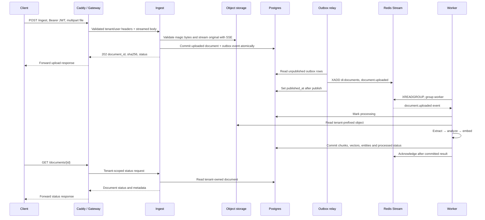

# Architecture

doc-insight turns PDF and image bytes into tenant-scoped, searchable passages with page
citations and extracted entities. The implemented processing slice is the worker CLI, Redis
consumer and transactional Postgres/pgvector storage, pipeline version 6. The service layer accepts authenticated
uploads, processes them asynchronously, and answers questions using retrieved passages.
Docker Compose runs the services locally; [private deployment](private-deployment.md) records the private release configuration.

## System diagram

The diagram shows service boundaries and data paths. Solid arrows
denote requests/writes; dashed arrows denote reads, asynchronous delivery or telemetry.
The component table below identifies what is implemented. General-purpose audit
storage is not implemented.


## Component responsibilities and delivery status

| Component | Responsibility | Release implementation |
| --- | --- | --- |
| Client / SDK | Upload files and ask questions | Static browser UI with upload progress, document status, filters, citations and usage; CLI remains available |
| Caddy | Static frontend and private API proxy | Implemented in Compose with an internal CA for localhost, proxying to the gateway ([deployment](deploy.md)) |
| Gateway, port 8000 | Validate RS256 JWT against JWKS; derive tenant/user; rate-limit and proxy | Implemented; [runbook](gateway.md) |
| Ingest, port 8001 | Stream validated uploads to objects; create document/outbox transaction; status reads and relay | Implemented; [upload, status and relay](ingest.md) |
| Query, port 8002 | Retrieve tenant-owned evidence; generate cited answer or abstain | Implemented; [operation and confidence](query.md) |
| Worker, no HTTP port | Extract → analyze → embed → store | CLI and `di worker run` share the pipeline; status transitions, replay, reclaim and DLQ are implemented |
| Object storage, ports 9000/9001 | Original bytes in `documents`, at `{tenant_id}/{sha256}` | MinIO with mandatory SSE-S3 runs in the Compose `infra` profile; the ingest adapter streams originals into it |
| Redis, port 6379 | Event stream, worker group, DLQ and rate-limit buckets | Redis runs in the Compose `infra` profile; the ingest relay publishes `di:documents` and `di worker run` consumes it; the gateway keeps its token buckets there |
| Postgres, port 5432 | Relational metadata and 384-dimensional pgvector HNSW index | Implemented, including forced row-level security ([ADR-0005](adr/0005-tenant-row-level-security.md)); outbox implemented ([ADR-0007](adr/0007-transactional-outbox.md)); full-text expression retrieval implemented; `audit_events` delivery unassigned |
| LLM | OpenAI answer generation behind a provider boundary; extractive fallback | Implemented; hosted calls are opt-in, offline fallback validated |
| Collector, port 4318; Prometheus; Tempo; Grafana | OTLP/HTTP ingestion, metrics, traces and dashboards | Implemented with HTTP and processing spans; active trace context propagates through HTTP and outbox/worker paths (see [evidence](evidence/README.md)) |

Ports above are internal contracts. The Compose `infra` and `telemetry` profiles publish every
service on loopback with configurable host ports (see [local stack](local-stack.md)).
The `app` profile runs four application images plus relay, migration, development issuer
and Caddy. Only Caddy publishes application ports, also on loopback. These are local
services, not a deployed public website. `audit_events` has no implementation or migration.
Full-text retrieval uses a `tsvector` expression with a GIN index in migration 0004.
Tenant-scoped token reservations and usage events share the forced-RLS database.
The private deployment removes infrastructure host ports and serves HTTPS through Tailscale.

## Upload and processing path



Duplicate `(tenant_id, sha256)` uploads return the existing ID with response status
`duplicate`, without reprocessing. `duplicate` is not a database lifecycle state.
The lifecycle is `uploaded → processing → processed | failed`; failures record a sanitized
error class and short message. The object write is outside the SQL transaction: the outbox
does not make object storage and Postgres one atomic resource. A failed insert after the
object write leaves an orphan that a later identical upload overwrites
([ADR-0007](adr/0007-transactional-outbox.md)).

## Question and answer path

```mermaid
sequenceDiagram
    participant C as Client
    participant G as Caddy / Gateway
    participant Q as Query
    participant E as Embedder
    participant D as Postgres + pgvector
    participant L as Answer provider
    C->>G: POST /query, Bearer JWT, question/top_k/filter
    G->>Q: Authenticated tenant/user headers + JSON
    Q->>E: Embed question, at most 126 content tokens
    E-->>Q: 384-dimensional vector
    Q->>D: Tenant-filtered vector + full-text retrieval
    D-->>Q: Candidate passages and entities
    Q->>Q: Reciprocal rank fusion and top-k evidence
    alt Retrieved passages available
        Q->>L: Question + retrieved passages
        alt OpenAI available within timeout and breaker closed
            L-->>Q: Generated answer
        else Offline, provider failure or breaker open
            L-->>Q: Extractive fallback
        end
    else No retrieved passages
        Q->>Q: Produce unsupported empty generation
    end
    Q->>Q: Validate citations and score grounding; answer or abstain
    Q-->>G: answer, confidence, abstained, sources, entities, retrieval, generation, latency_ms
    G-->>C: Forward answer response
```

Current `di search` only embeds a question and returns tenant-filtered cosine neighbors.
It has no full-text ranking, generation, confidence or abstention. Similarity is not confidence.
The optional hosted provider receives question/passage content; this is a data-transfer boundary
even though operational logs must exclude that content.

## Tenancy and security

**Implemented:** every storage method takes a tenant; reads filter by it. Composite foreign
keys prevent chunks/entities from referring to another tenant's document. Forced row-level
security (migration `0002`, [ADR-0005](adr/0005-tenant-row-level-security.md)) makes the
database itself refuse cross-tenant rows: each transaction binds the tenant with a
transaction-local setting, and the restricted runtime login has neither superuser nor
`BYPASSRLS` rights. The CLI trusts the supplied nonblank tenant. It has no credential
validation, object-storage adapter or TLS. Local Postgres is loopback-only with development
credentials.

**Implemented:** the gateway alone derives identity from RS256 JWT claims verified
against JWKS. It strips client-supplied `X-Tenant-Id` and `X-User-Id`, then injects its own.
**Implemented in ingest and query:** both require `X-Tenant-Id` (400 if absent) and
trust it only on the internal network. Tenant IDs are 1–64 characters from `[A-Za-z0-9._-]`.
**Implemented in ingest:** per-tenant object prefixes through the object-storage adapter. MinIO in
the local stack already requires SSE-S3 for the `documents` bucket, so originals are encrypted
at rest there. This does not assert encryption of every database, cache or telemetry volume.

**Implemented:** Caddy serves the frontend and proxies the gateway, with a local
internal CA for development HTTPS. The private server uses Tailscale Serve HTTPS
and encrypted host storage; its infrastructure ports are not published. Gateway-to-service and local MinIO traffic use HTTP inside the Compose
network; end-to-end internal TLS is not a guarantee. See [deployment](deploy.md) for
TLS, development keys and the production boundary.

Operational logs contain IDs, counts, durations, statuses and error classes. They must not
contain document text, questions, user filenames, vectors or tokens. Explicit CLI output
contains document data and requires the same handling as its input.

## Reliability

**Implemented:** document upsert locks the unique tenant/hash row and replaces metadata,
chunks and entities in one transaction. Replay preserves the document and child IDs;
failure rolls back all output. Reads use a consistent snapshot. Expensive extraction and
inference occur before the transaction, so replay repeats CPU work.

**Implemented:** the outbox commits intent with the document
([ADR-0007](adr/0007-transactional-outbox.md)). The relay publishes to `di:documents` before
marking the row published. A crash between those operations can republish, so delivery is
at least once. Group `worker` persists idempotently, acknowledges after durable completion,
reclaims pending work and sends exhausted failures to `di:documents:dlq` with original fields
plus `error` and `attempts` ([worker runbook](worker.md)). Retry/reclaim thresholds are worker
settings; no timing guarantee is asserted here.

**Implemented:** timeouts and a circuit breaker bound OpenAI failures; extractive fallback
avoids a provider dependency for every answer. Abstention handles insufficient evidence;
breaker thresholds and evidence rules are in [query.md](query.md) and
[ADR-0008](adr/0008-hybrid-query.md).

**Implemented in ingest, query and the gateway:** HTTP services expose
dependency-free `GET /healthz` and dependency-checking `GET /readyz` (503 when unavailable). **Implemented:** the worker writes
`di:worker:{hostname}-{pid}` in Redis at loop/message boundaries. Its settings default
is 30 seconds; Compose explicitly uses a 600-second heartbeat TTL and 900-second
reclaim delay to tolerate long native stages. There is no hard processing deadline.
The observability helper emits stage durations and request spans. The gateway and
relay inject their active context, connecting downstream services and asynchronous
processing. [Captured traces](evidence/README.md) demonstrate both upload and query.

## Trade-offs

These decisions describe the implemented design; [the load report](../benchmark/README.md) records measured capacity and saturation.

| Decision | Alternative | Why | When to revisit |
| --- | --- | --- | --- |
| pgvector in Postgres (implemented) | Dedicated vector database | One transaction/backup boundary for metadata and vectors | Representative tenant-filtered recall or latency misses the agreed budget |
| Redis Streams (relay and consumer implemented) | Separate message broker | Shares Redis with rate limiting and supplies consumer groups | Pending-work recovery, retention or throughput exceeds measured limits |
| Multilingual MiniLM (implemented) | multilingual-e5-large | Existing 384-dimensional profile and 120/24 chunks pass the small regression set | Bilingual holdout recall@5 below 0.8; compare latency/memory before switching (ADR-0003) |
| ONNX on CPU (implemented) | GPU inference | Current adapter runs without a PyTorch/GPU dependency | Measured inference throughput cannot meet the deployment budget |
| Compose first (implemented: infrastructure, telemetry, service images, migration job and Caddy TLS) | Kubernetes | One local entry point with locked images and Caddy TLS ([ADR-0011](adr/0011-compose-service-images.md)) | Multi-node availability or orchestration requirements justify manifests |
| Application filters + forced RLS (implemented, [ADR-0005](adr/0005-tenant-row-level-security.md)) | Schema per tenant | Shared schema with database enforcement of the same tenant boundary | Isolation or tenant-specific lifecycle requirements outweigh shared-schema operations |

## Further reading

- [Pipeline and worker settings](pipeline.md): implemented stages, storage semantics and limits.
- [API contract](api.md): HTTP and stream payloads.
- [Configuration index](configuration.md): current environment settings and their scope.
- [CI](ci.md): gates and test tiers.
- [ADR-0001](adr/0001-text-extraction.md): extraction and OCR alternatives.
- [ADR-0002](adr/0002-structured-representation.md): chunks and citation offsets.
- [ADR-0003](adr/0003-embeddings-and-vector-storage.md): embedding/storage choices and upgrade criterion.
- [ADR-0004](adr/0004-opentelemetry.md): OpenTelemetry with OTLP to a collector.
- [ADR-0005](adr/0005-tenant-row-level-security.md): forced row-level security and the two-role model.
- [ADR-0006](adr/0006-local-infrastructure.md): independent infrastructure and telemetry profiles.
- [Observability](observability.md): the shared helper API and attribute policy.
- [Local stack](local-stack.md): Compose profiles, ports, encryption and Grafana.

The [query guide](query.md), [ingest guide](ingest.md), [worker runbook](worker.md) and
[gateway runbook](gateway.md) describe implemented services. [Deployment](deploy.md) covers
local startup; [private deployment](private-deployment.md) covers private operation and remaining scale/identity limitations.
