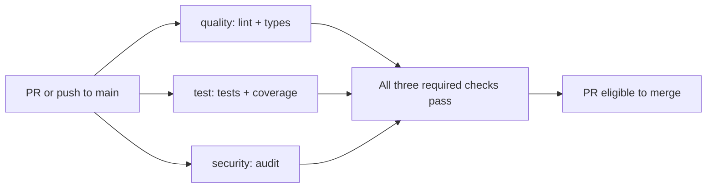

# Phase 0 CI

Every PR and push to `main` runs three independent jobs; superseded runs are cancelled.

| Step | What | Why it exists | What a failure means |
| --- | --- | --- | --- |
| Setup | Sync every workspace member from uv.lock | Reproduce the same environment | Lockfile, download or installation failed |
| quality | `make lint` + `make typecheck` | Catch style defects and type errors | Fix the reported code or formatting |
| test | `make test`; upload coverage.xml for 7 days | Check behavior and enforce 70% coverage | Tests failed, coverage fell below 70%, or upload failed |
| OCR binary | Install Tesseract and Croatian data in the test job | Exercise actual scan extraction on Ubuntu without model downloads | Installation failed or required language data is unavailable |
| security | `make audit`: bandit, pip-audit, gitleaks | Catch unsafe Python, vulnerable dependencies and exposed secrets | Review and fix the reported finding or tool failure |

## Run the same locally

Install uv, GNU Make and Go (1.24.11+); uv selects Python from `.python-version`.
Run `make setup`, then `make check`; individual gates are the table's Make targets.
Install hooks with `uv run --locked pre-commit install`.
Hooks run `make lint` (both Ruff checks) and `make audit` (including gitleaks).
Use `uv run --locked pre-commit run --all-files` to verify the hooks manually.
Gitleaks uses a pinned upstream Go module and scans current files, including staged edits;
it excludes dependencies/caches, and does not scan deleted secrets in Git history.
pip-audit skips editable workspace stubs; their installed third-party dependencies are audited.
Tests cover extraction/OCR, structure, provider contracts and CLI output; Python socket access is blocked.
Lingua/spaCy models install with dependencies; runtime downloads run separately with `make test-models`, outside CI.
Local `make test` needs Tesseract with `eng` and `hrv`, as described in [pipeline setup](pipeline.md).

## Protect main by hand

Settings → Branches → Add classic branch protection rule → branch name pattern `main`:
- [ ] Enable **Require a pull request before merging**.
- [ ] Enable **Require status checks to pass before merging**; select `quality`, `test`, `security`.
- [ ] Enable **Require linear history**.
- [ ] Leave **Allow force pushes** unchecked.
- [ ] Enable **Do not allow bypassing the above settings** (includes administrators).
Until this rule is active, failed checks do not prevent a merge.
GitHub offers branch protection on public repositories or paid plans;
while this repository is private on the free plan, defer it until publication.

## Not in phase 0 on purpose

| Work | Milestone |
| --- | --- |
| Image build/publish; SBOM and provenance; service-backed integration tests | Chunk 6 — Tests and CI hardening |
| Kubernetes deployment and autoscaling | Chunk 8 — Kubernetes, autoscaling, benchmark |

Only checkout, setup-uv and upload-artifact actions are allowed, with read-only contents permission.
setup-uv uses `v7`, its last published major tag; v8+ only publish full version tags.
Dependabot checks actions and Python dependencies weekly, grouping minor/patch changes.
The `uv` ecosystem updates `uv.lock`, the file `make setup` installs from.
