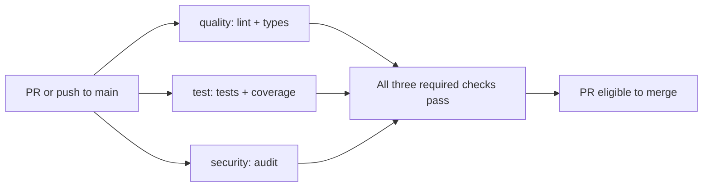

# CI gates

Every PR and push to `main` runs three independent verification jobs; superseded
runs are cancelled. Successful main pushes also run the image publication job.

| Step | What | Why it exists | What a failure means |
| --- | --- | --- | --- |
| Setup | Sync every workspace member from uv.lock | Reproduce the same environment | Lockfile, download or installation failed |
| quality | `make lint` + `make typecheck` + `docker compose --profile infra --profile telemetry config --quiet` | Catch style, type and Compose configuration errors | Fix the reported code, formatting or configuration |
| test | `make test`, then `make test-integration`; upload coverage.xml for 7 days | Enforce 70% unit coverage and prove the real storage contract | Behavior, migration, isolation or coverage failed |
| Postgres | Healthy pgvector/Postgres 16 service | Exercise transactions, tenant constraints and vector retrieval | Service startup or database assertions failed |
| Redis | Pinned Redis 7 service, checked with `redis-cli ping` | Provide the queue backend for integration tests | Service startup failed |
| MinIO | Pinned official image started through Compose; ready probe, bucket creation and SSE-S3 check | Provide initialized S3 storage with the same settings as local development | Startup or encryption initialization failed |
| OCR binary | Install Tesseract and Croatian data in the test job | Exercise actual scan extraction on Ubuntu without model downloads | Installation failed or required language data is unavailable |
| security | `make audit`: bandit, pip-audit, gitleaks | Catch unsafe Python, vulnerable dependencies and exposed secrets | Review and fix the reported finding or tool failure |

## Run the same locally

Install uv, GNU Make and Go (1.24.11+); uv selects Python from `.python-version`.
Run `make setup`, then `make check`; individual gates are the table's Make targets.
Install hooks with `uv run --locked pre-commit install`.
Hooks run `make lint` (both Ruff checks) and `make audit` (including gitleaks).
Use `uv run --locked pre-commit run --all-files` to verify the hooks manually.
Gitleaks uses a pinned upstream Go module and scans current files, including staged edits;
it excludes dependencies/caches, and does not scan deleted secrets in Git history.
pip-audit skips editable workspace stubs; their installed third-party dependencies are audited.
Tests cover extraction/OCR, structure, provider contracts and CLI output; Python socket access is blocked.
`make db-up`, then `make test-integration` exercises temporary databases; it never downloads models.
The integration target leaves unit coverage.xml intact; it runs alongside unit tests in the `test` job.
The job exports `DI_MIGRATION_DATABASE_URL`, `DI_REDIS_URL` and all six `DI_S3_` connection
settings shown in [local stack](local-stack.md). Integration fixtures preserve
these connection settings; default tests still clear them and forbid sockets.
GitHub Actions cannot pass a command to a declarative service, so the MinIO step
runs `docker compose up -d --wait --wait-timeout 60 minio`, then
`docker compose run --rm minio-init`. Its cleanup runs even after test failure.
Postgres and Redis remain GitHub-managed service containers. Telemetry is not
started in this job; the target remains roughly three minutes with dependency
caches, while first-time downloads and runner/OCR installation can exceed it.
The existing integration suite exercises Postgres; Redis/S3 adapter contracts
join this job as their service implementations arrive.
Lingua/spaCy models install with dependencies; runtime downloads run separately with `make test-models`, outside CI.
Local `make test` needs Tesseract with `eng` and `hrv`, as described in [pipeline setup](pipeline.md).

## Protect main by hand

Settings → Branches → Add classic branch protection rule → branch name pattern `main`:
- [ ] Enable **Require a pull request before merging**.
- [ ] Enable **Require status checks to pass before merging**; select `quality`, `test`, `security`.
- [ ] Enable **Require linear history**.
- [ ] Leave **Allow force pushes** unchecked.
- [ ] Enable **Do not allow bypassing the above settings** (includes administrators).
Until this rule is active, failed checks do not prevent a merge.
GitHub offers branch protection on public repositories or paid plans;
while this repository is private on the free plan, defer it until publication.

## Deferred work

| Work | Milestone |
| --- | --- |
| HTTP service integration tests | Service delivery |
| Kubernetes deployment and autoscaling | Chunk 8 — Kubernetes, autoscaling, benchmark |

Verification uses checkout, setup-uv and upload-artifact, with read-only contents permission.
setup-uv uses `v7`, its last published major tag; v8+ only publish full version tags.
Dependabot checks actions and Python dependencies weekly, grouping minor/patch changes.
The `uv` ecosystem updates `uv.lock`, the file `make setup` installs from.

## Image publication

`images` waits for quality, test and security and runs only on pushes to `main`
in the upstream repository. Forks and all pull requests skip the job. Only this
job has `packages: write`; the workflow's default remains `contents: read`.
The repository action allowlist must also allow `docker/setup-buildx-action`,
`docker/login-action` and `docker/build-push-action` for publication.

The matrix builds gateway, ingest, query and worker for Linux amd64 from the
parameterized Dockerfile. Each installs its locked production workspace package,
uses a cache scoped by application, and publishes both the full commit SHA and
`main` to `ghcr.io/karlo93/doc-insight-<app>`. Relay reuses ingest and migration
reuses worker. Buildx attaches an SBOM and maximum provenance to the registry
image manifest; no secrets are supplied through build arguments. See Docker's
[attestation documentation](https://docs.docker.com/build/ci/github-actions/attestations/).

The quality job validates all Compose profiles, including pending service
definitions. Validate images locally with `bash scripts/smoke_images.sh` after
building. `bash scripts/smoke_tls.sh` verifies HTTPS forwarding against an isolated
test upstream and cleans up its containers/network; it does not test the gateway.
`make local-run` additionally verifies health and migration completion.
Container builds have their own job and do not extend the test job's time budget.
