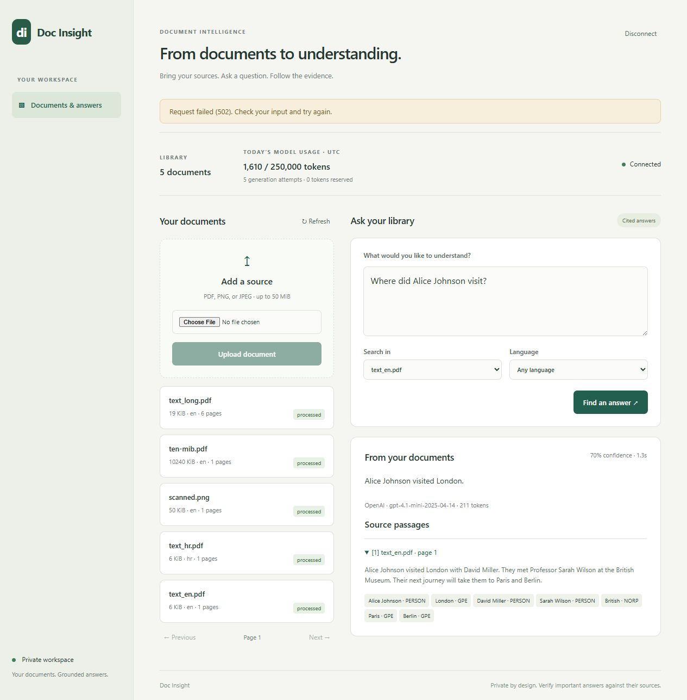
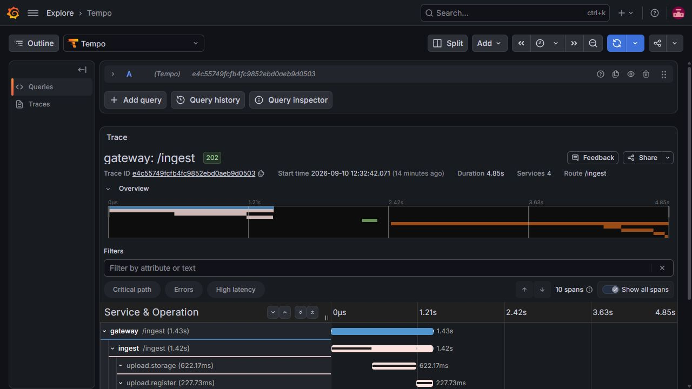
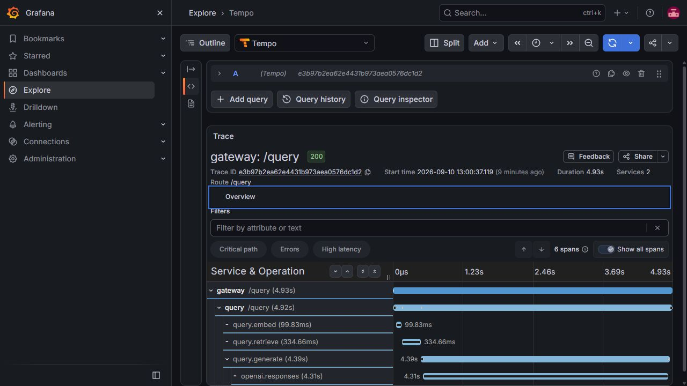
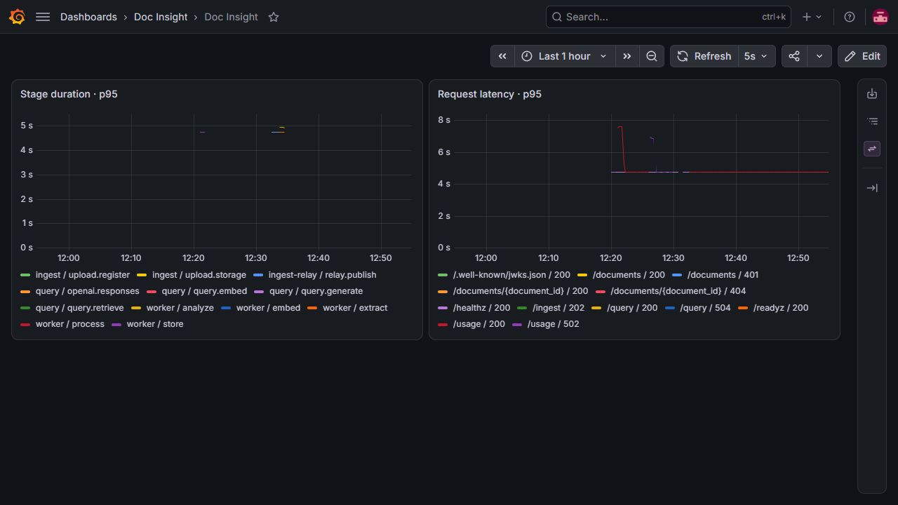

# Release evidence

Captured on 2026-09-10 using generated repository fixtures. No customer documents,
credentials, private hostnames or deployment configuration are included.

## Browser and observability

The browser uploaded and processed a six-page PDF on the private server, submitted
a document-filtered question and expanded its cited passage. Live OpenAI generation,
token usage, source page and extracted entities are visible. The current UI labels
the legacy confidence value as an **evidence score**, because it is not calibrated.

The local 10-MiB upload trace contains ten spans across gateway, ingest, relay and
worker. The async publication span parents worker processing; extract, analyze,
embed and store are children. Trace ID: `e4c55749fcfb4fc9852ebd0aeb9d0503`.

Six spans connect gateway `/query`, query `/query`, embedding, retrieval, generation
and `openai.responses`. Trace ID: `e3b97b2ea62e4431b973aea0576dc1d2`. This particular
local capture ran during image building and took 4.93 seconds; it demonstrates
parentage, not unloaded performance. See the separate load report for measurements.

The provisioned local Grafana dashboard shows real stage and HTTP duration series.
The one-hour window includes startup-related 502/504 responses and successful
acceptance traffic; it is not a claim of an error-free hour. Service labels and
route templates keep cardinality bounded and avoid raw question/filename labels.

## Automated checks and real-stack acceptance

- Linux CI default suite: **464 passed**, 91 deselected, **92.71% coverage**.
  Local run before the three allowlist cases: 461 passed, 92.61%.
- Real service integration tier: **68 passed**, 487 deselected (final CI).
- Pinned tokenizer/embedding model tier: **23 passed**, 529 deselected.
- Ruff, formatting, strict mypy, Compose base/private validation and JavaScript
  syntax checks passed. Bandit and pip-audit passed; local workspace and spaCy wheel
  entries not indexed by PyPI remain outside pip-audit's advisory coverage.
- Gitleaks 8.30.1 scanned all fetched Git history and the proposed public source tree
  with redaction enabled; no leaks found. Ignored runtime credentials were excluded
  from the publication tree, never copied into an image or browser asset.
- The HTTP acceptance command passed locally and on the private server: text PDF,
  Croatian PDF, OCR image, duplicate identity, 10-MiB PDF, both tenant relays,
  cross-tenant denial, missing JWT, real English/Croatian OpenAI answers, citations,
  unsupported-question abstention and recorded token usage.

GNU Make and Go were unavailable on the Windows host. Their individual gates were
run directly through uv, Docker, Node and a checksum-verified pinned gitleaks binary;
this is not described as a literal local `make check` invocation. CI runs the Make
targets on Linux. Raw runtime logs remain ignored because they can include local
paths, generated document content or private deployment details.

## Recovery

An AES-256 encrypted consistent backup was created after pausing application writes.
The live stack restarted successfully. A separate disposable network and fresh
volumes restored PostgreSQL, encrypted MinIO data and its key, Redis AOF, issuer
private keys and public JWKS. Verification found:

| Restored item | Verified result |
| --- | ---: |
| Documents / original SHA-256 matches | 6 / 6 |
| Chunks | 29 |
| Entities | 60 |
| Outbox rows / Redis stream events | 6 / 6 |
| Usage events / daily budgets | 5 / 1 |
| Restored signing key + JWKS | Mint and verify passed |

The encrypted archive was copied off-host and its SHA-256 verified. The decryption
passphrase is stored separately from the archive. This proves this snapshot's
recovery; recurring backup scheduling and retention remain an operator decision.
Use [the recovery commands](../private-deployment.md#validation-upgrades-and-recovery).

## Assignment closure and limits

The [historical review](../assignment-review.md) records the starting gaps. The
release supplies the browser, OpenAI credential path/accounting, connected trace
screenshots, real E2E, [load report and raw evidence](../../benchmark/README.md),
private-server runbook and recovery scripts. The existing architecture and twelve
ADRs are retained; for the assignment's requested 1–3 ADR selection, use
[0003](../adr/0003-embeddings-and-vector-storage.md),
[0007](../adr/0007-transactional-outbox.md) and
[0012](../adr/0012-openai-private-delivery.md).

The app is deliberately private and uses operator-issued short-lived JWTs. It has
no public self-service login, password reset, multi-node HA or Kubernetes deployment.
The fixture corpus and heuristic evidence score limit accuracy/capacity claims.
At 100 offered full-query RPS, the present query allocation is overloaded. Internal
single-host container traffic trusts its isolated network; host-crossing user traffic
uses private HTTPS, provider traffic uses HTTPS, and disk/backup data is encrypted.

## Image identity

The initial four locally built images were exported together and loaded on the private
server; [image evidence](images.json) records both engines' IDs, exact filesystem
layer digests and a normalized runtime-configuration hash. Docker's save/load path
normalizes null/absent `Cmd`, `Volumes` and `OnBuild` fields, producing different
image IDs between these engines. Every filesystem layer and non-null runtime
configuration value matches; these are transferred builds, not independent rebuilds.
The 120-second baseline used the earlier candidate query image
`sha256:aa4a27a05f8600e07578d57711aedc3f2f4b03c27c2d8508a9c96371e0e25877`.
Final-image confirmation is retained separately in the benchmark data. The later
gateway-only authentication-pool fix was also built locally and transferred;
unchanged service images retain identical layers.

CI on the initial release commit passed all three jobs: [run 34471097109](https://github.com/Karlo93/doc-insight/actions/runs/34471097109). Subsequent fixes receive their own CI run.

The corrected Caddy deployment passed a repeat ten-minute run: 12,000 queries,
zero errors/drops, p95 97.72 ms. Authentication-pool isolation was then stressed with
forced five-second JWKS expiry during 100 offered query RPS; no authentication or
HTTP errors occurred, while CPU-related client drops remained explicit.
