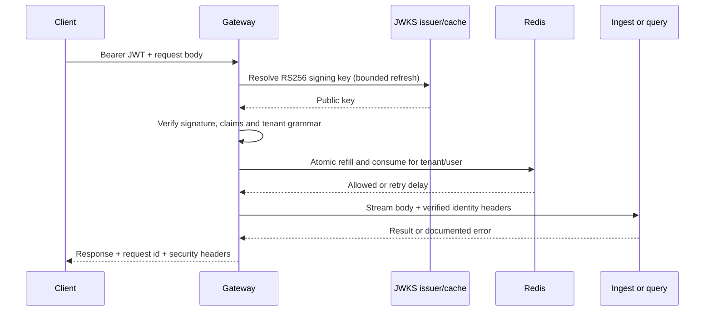

# Gateway

`doc_insight.gateway.main:app` is the public HTTP API. `di-gateway serve` listens on
127.0.0.1:8000 by default. TLS terminates at the deployment reverse proxy. Keep ingest,
query and Redis private: only the gateway derives identity from credentials.



Authentication requires `sub`, `tenant`, `exp`, `iat`, `iss` and `aud`. Only RS256 is
accepted. Tenant ids contain 1–64 ASCII letters, digits, dots, underscores or hyphens.
User ids contain 1–256 visible ASCII characters so they can be safely forwarded as headers.
JWT numeric dates must be integers. Failures return the same `invalid token` message.
JWKS URLs come only from configuration; token `jku` and `x5u` headers are not used.
Unknown keys refresh within the configured cooldown. Failed refreshes also back off.
An expired cache is never used to accept a token. Keys must be public RSA keys of at
least 2048 bits with unique, nonempty `kid` values and signing/verification usage.

| Route | Destination | Authentication |
| --- | --- | --- |
| `POST /ingest` | Ingest `/ingest` | Required |
| `GET /documents/{id}` | Ingest, UUID id | Required |
| `POST /query` | Query `/query` | Required |
| `GET /healthz` | Process liveness | Public |
| `GET /readyz` | Redis and both upstream `/readyz` checks | Public |
| `GET /.well-known/jwks.json` | Development public keys, if enabled | Public |

Incoming tenant/user headers, cookies, bearer credentials and forwarding headers do
not reach services. The gateway sets verified `X-Tenant-Id` and `X-User-Id`, forwards
`traceparent`, content type and accept headers, and sets `X-Request-Id`. A caller may
supply a request id of 1–128 letters, digits, dots, underscores or hyphens; otherwise
the gateway generates a UUID. The same id is returned on every response.

Every response has `Cache-Control: no-store` and `X-Content-Type-Options: nosniff`.
CORS is absent by default; configured origins permit GET/POST and explicit auth/content
headers. Response cookies and upstream redirects are not forwarded. Successful response
bodies are read in memory; multipart requests stream without whole-body buffering.
The upload limit covers the entire multipart envelope. Declared oversized requests are
rejected before forwarding; streamed bodies stop before the chunk that exceeds the limit.
Ingest must clean up an incomplete body. Query strings are not forwarded because none
of the public routes define query parameters.

One Redis bucket covers all authenticated routes for each tenant/user. It starts full,
refills continuously at RPS up to burst capacity, and charges one token per authenticated
attempt. `X-RateLimit-Remaining` is the floor of remaining tokens. A 429 includes an
integer `Retry-After` rounded up to the next available token. Idle keys expire after
`burst / RPS` seconds. Redis failures default to 503; fail-open mode skips enforcement
and omits the unknown remaining count. Readiness stays 503 during an outage either way.

The shared `instrument_app` supplies one request span. Proxied requests attach `tenant.id`
and `user.id`; credentials and bodies are never attached. Access logs are disabled in
the CLI. Telemetry configuration is described in [observability](observability.md).

## Settings

Export variables before startup. One cached Pydantic-settings object validates them.
`.env.example` documents values; the CLI does not load `.env` automatically.

| Variable | Default | Purpose |
| --- | --- | --- |
| `DI_JWKS_URL` | `http://127.0.0.1:8000/.well-known/jwks.json` | Trusted public key source |
| `DI_JWT_ISSUER` | `doc-insight-dev` | Required issuer |
| `DI_JWT_AUDIENCE` | `doc-insight` | Required audience |
| `DI_JWT_LEEWAY_SECONDS` | `30` | Nonnegative clock skew allowance |
| `DI_JWKS_CACHE_SECONDS` | `300` | Key-cache lifetime |
| `DI_JWKS_REFRESH_SECONDS` | `5` | Minimum interval between fetch attempts |
| `DI_DEV_JWKS_PATH` | Unset | Development-only public JWKS file; blank disables |
| `DI_REDIS_URL` | `redis://127.0.0.1:6379/0` | Shared quota store |
| `DI_REDIS_TIMEOUT_SECONDS` | `2` | Redis connect and command timeout |
| `DI_RATE_LIMIT_RPS` | `5` | Positive continuous refill rate |
| `DI_RATE_LIMIT_BURST` | `10` | Positive integer bucket capacity |
| `DI_RATE_LIMIT_FAIL_OPEN` | `false` | Allow authenticated requests on Redis failure |
| `DI_MAX_UPLOAD_BYTES` | `52428800` | Maximum total request body, 50 MiB |
| `DI_INGEST_URL` | `http://127.0.0.1:8001` | Ingest base URL |
| `DI_QUERY_URL` | `http://127.0.0.1:8002` | Query base URL |
| `DI_UPSTREAM_TIMEOUT_SECONDS` | `30` | Query deadline; ingest gets four times this value |
| `DI_CORS_ORIGINS` | Empty | Comma-separated explicit HTTP(S) origins; no wildcard |
| `DI_GATEWAY_HOST` | `127.0.0.1` | CLI bind address; container uses `0.0.0.0` |
| `DI_GATEWAY_PORT` | `8000` | CLI listen port |
| `GATEWAY_PORT` | `8000` | Compose host publication port only |

JWKS requests have a five-second deadline and 256 KiB limit. Readiness probes have
two-second deadlines. Upstream error bodies are limited to 64 KiB.

## Errors

All gateway errors have `{"error":{"code":"...","message":"..."}}`.

| Status | Code | Meaning |
| --- | --- | --- |
| 400 | `invalid_request` | Invalid body framing or disconnected upload |
| 401 | `unauthorized` | Missing or invalid token; includes `WWW-Authenticate: Bearer` |
| 404 | `not_found` | Development JWKS disabled |
| 413 | `payload_too_large` | Declared or streamed request exceeds the limit |
| 422 | `validation_error` | Invalid document UUID |
| 429 | `rate_limited` | Bucket exhausted |
| 500 | `internal_error` | Unexpected gateway failure |
| 502 | `bad_gateway` | Connection failure, redirect or invalid upstream error |
| 503 | `rate_limit_unavailable` / `not_ready` | Quota store or readiness failure |
| 504 | `upstream_timeout` | Deadline exceeded or upstream 504 |
| Other routing status | `http_error` | Unmatched route or unsupported method |

Upstream 4xx responses pass through only if JSON contains exactly `error.code` and
`error.message`: a lowercase identifier code (at most 64 characters) and a message
of at most 1024 characters. Other bodies are discarded. Services must keep documented
error messages free of document text. Upstream 5xx messages never pass through.

## Try it yourself

From a clean clone, install dependencies and generate keys once:

```sh
uv sync --locked --all-packages
uv run --locked --all-packages python scripts/dev_keys.py
export DI_DEV_JWKS_PATH=.dev-keys/jwks.json
export DI_REDIS_URL=redis://127.0.0.1:6379/0
docker compose up -d --wait redis
uv run --locked --all-packages di-gateway serve
```

PowerShell uses `$env:DI_DEV_JWKS_PATH='.dev-keys/jwks.json'` and
`$env:DI_REDIS_URL='redis://127.0.0.1:6379/0'`. Use the published Redis port if changed.
The keys directory is ignored, creation refuses to overwrite it, and only `jwks.json`
is served. POSIX creation restricts private-file permissions; on Windows keep the
directory under an account-private location. A new `--directory` creates a rotation
pair; change the JWKS path and restart the gateway. Never commit or share private keys.
The default generated files under `.dev-keys` are excluded from the local directory
secret scan. All other source paths remain scanned; custom key directories should be
outside the checkout. The container build excludes keys and development inputs.

In another shell, with ingest and query running at the configured URLs:

```sh
TOKEN=$(uv run --locked --all-packages python scripts/mint_token.py --tenant demo --user alice --ttl 3600)
curl -H "Authorization: Bearer $TOKEN" -F file=@tests/fixtures/text_hr.pdf http://127.0.0.1:8000/ingest
curl -H "Authorization: Bearer $TOKEN" http://127.0.0.1:8000/documents/REPLACE_WITH_DOCUMENT_UUID
curl -H "Authorization: Bearer $TOKEN" -H 'Content-Type: application/json' \
  -d '{"question":"Gdje se nalazi Zagreb?","top_k":5}' http://127.0.0.1:8000/query
```

Wait for document status `processed` before querying. In PowerShell mint with
`$TOKEN = uv run --locked --all-packages python scripts/mint_token.py --tenant demo --user alice --ttl 3600`
and use `curl.exe`. To show 429 reliably, restart with `DI_RATE_LIMIT_RPS=0.01` and
`DI_RATE_LIMIT_BURST=2`, mint for a fresh user, then loop:

```sh
TOKEN=$(uv run --locked --all-packages python scripts/mint_token.py --tenant demo --user quota-demo --ttl 3600)
for i in 1 2 3 4 5; do
  curl -i -H "Authorization: Bearer $TOKEN" -H 'Content-Type: application/json' \
    -d '{"question":"Zagreb?"}' http://127.0.0.1:8000/query
done
```

The first two attempts consume capacity even if query is unavailable; subsequent ones
return 429 with `Retry-After`. PowerShell can use `1..5 | ForEach-Object { curl.exe ... }`.

The optional development Compose overlay builds just the gateway's locked dependencies:

```sh
docker compose -f docker-compose.yml -f docker-compose.gateway.yml up -d --build --wait gateway
```

It points JWKS at the gateway itself and mounts only the public JSON. Generate keys
first. Ingest and query must be supplied on the same Compose network under those service
names, or override their URLs; without them liveness is 200 and readiness is 503.
This overlay is development-only and provides plain HTTP on loopback, not TLS.

```sh
uv run --locked --all-packages pytest tests/gateway --no-cov
DI_REDIS_URL=redis://127.0.0.1:6379/0 uv run --locked --all-packages pytest tests/gateway -m integration --no-cov
make check
```

Offline tests generate session keys, use an in-process ASGI upstream, and share provider
contracts between fakes and real adapters. Redis tests use unique tenant keys and remove
only those keys. Fifty concurrent requests must admit exactly the configured burst.
See [ADR-0007](adr/0007-gateway-identity-and-rate-limits.md) for the trade-offs.
