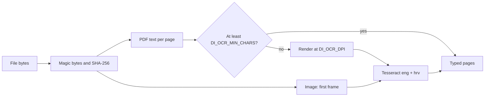

# Pipeline: M1 extraction

`di extract` is the file-to-text edge of the worker. It reads local PDF, PNG,
JPEG and TIFF files; it does not contact a service or persist a document.



`ExtractedDocument` contains `pipeline_version`, `sha256`, `media_type`, `pages`
and a derived `page_count`. Each `Page` has a one-based `number`, `text`,
`source` (`text_layer` or `ocr`) and derived `char_count`.
Both counts appear in JSON and cannot disagree with the current text/pages.
CRLF and CR become LF; surrounding whitespace is removed before counting.
Later chunk offsets must refer to this normalized page text.

The same byte snapshot supplies parsing and SHA-256, preventing a file changed
between two reads from producing text and a digest for different contents.
PDF handles, pages, text pages, bitmaps and Pillow images close explicitly.
The CLI is sequential: PDFium is not thread-safe, and pytesseract's command
setting is process-global. A future queue adapter must respect that constraint.

| Environment variable | Default | Purpose |
| --- | --- | --- |
| `DI_OCR_MIN_CHARS` | `20` | Below this many stripped characters, OCR the whole PDF page |
| `DI_OCR_DPI` | `200` | Raster resolution; must be positive |
| `DI_OCR_LANGS` | `eng+hrv` | Installed Tesseract language data |
| `DI_TESSERACT_CMD` | `tesseract` | Binary on PATH, or its full path |

One cached Pydantic-settings object reads the environment on first use.
Change environment values before starting `di`. `PIPELINE_VERSION = "2"` lives
in the extraction contracts; bump it whenever extraction output changes.
OCR text may vary across Tesseract/language-data versions; tests assert known
words, not byte-identical OCR output. Dependencies and fixture tooling use uv.lock.
Version 2 applies declared EXIF orientation before image OCR and removes the tag;
the sideways-JPEG regression test checks recovered words, not just nonempty output.
PDFium applies PDF rotation metadata when rendering. Unmarked sideways scans,
including images inside PDFs, still need orientation detection, which M1 does not do.

## Run it: WSL2/Linux

- Enable WSL2 and Docker Desktop's WSL integration; clone inside `~/src`, not `/mnt/c`.
- Open that checkout through VS Code's WSL connection.
- Install uv, GNU Make, Go (per [CI setup](ci.md)) and OCR:
  `sudo apt-get update && sudo apt-get install -y tesseract-ocr tesseract-ocr-eng tesseract-ocr-hrv`.
- Verify `tesseract --list-langs` includes `eng` and `hrv`, then run `make setup`.

## Run it: native Windows

- Install uv, GNU Make and Go and put their executables on PATH.
- Install Tesseract from [UB Mannheim](https://github.com/UB-Mannheim/tesseract/wiki), including English and Croatian language data.
- If it is absent from PATH, set `$env:DI_TESSERACT_CMD = 'C:\Program Files\Tesseract-OCR\tesseract.exe'` in PowerShell.
- Verify `& $env:DI_TESSERACT_CMD --list-langs` (or `tesseract --list-langs` on PATH), then run `make setup`.

Commands work from the repository root in either shell:

```text
uv run --locked --all-packages di extract tests/fixtures/mixed.pdf
uv run --locked --all-packages di extract tests/fixtures/text_hr.pdf --json
uv run --locked --all-packages di extract "inputs/demo-files/DSJ Europe Engineering Salary Guide.pdf"
uv run --locked --all-packages python scripts/make_fixtures.py
make check
```

The mixed fixture prints two pages: first `text_layer`, then `ocr`, with counts
and previews limited to 200 characters per page. JSON includes the full text.
These are explicitly requested CLI outputs, not log records; no document text
is logged. Treat redirected output as document data, and keep it under ignored
`inputs/` or `.cache/`. Missing files, invalid content and OCR failures exit nonzero.

Fixtures use a committed font subset, a fixed PDF creation date and twelve fixed
topics across six pages; rerunning the generator recreates all five files.
See [font provenance](../scripts/fonts/readme.md) and [ADR-0001](adr/0001-text-extraction.md).

## Not yet

M2 adds language, entities, tokenizer spans and chunks; M3 adds embeddings;
M4 adds tenant-filtered persistence, transactions and vector search.
There are no provider stubs for those stages before their first use.
Extraction has no tenant state or database; its CLI therefore needs no tenant yet.
Multi-frame TIFF traversal, mixed text/image regions within one page, encrypted
PDF passwords and parallel extraction are not implemented in M1.
